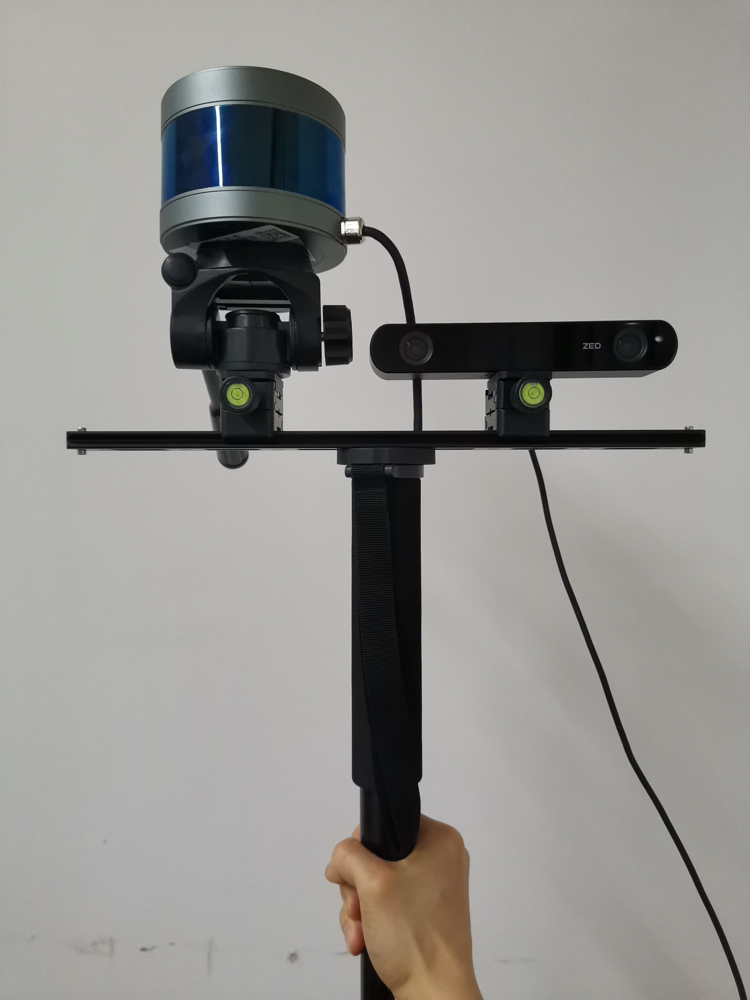
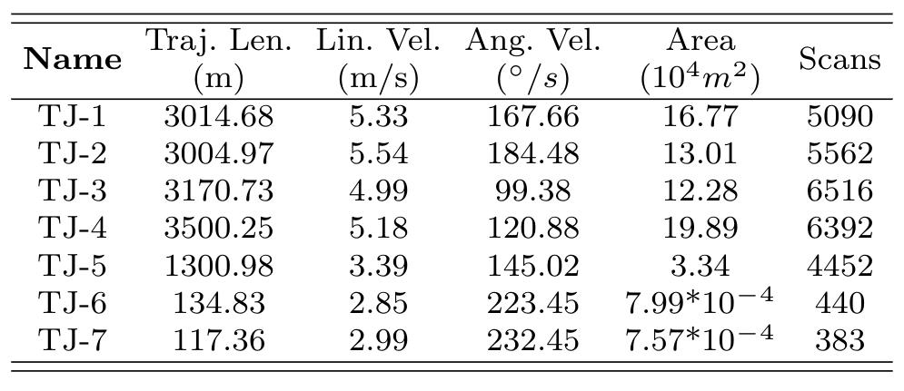

### D-LIOM: Tightly-coupled Direct LiDAR-Inertial Odometry and Mapping

Zhong Wang1, Lin Zhang1, Ying Shen1, and Yicong Zhou2

1School of Software Engineering, Tongji University, Shanghai, China

2Department of Computer and Information Science, University of Macau, China

#### Introduction

>  This is the website for our paper D-LIOM: Tightly-coupled Direct LiDAR-Inertial Odometry and Mapping.

#### TONGJI Handheld LiDAR-Inertial Dataset

[Dataset (pwd: hfrl)](https://pan.baidu.com/s/12Y6CErygofwPf9f8FrNLqA)

> As shown in Figure 1 below, our self-developed handheld data acquisition device includes a 16-line [ROBOSENSE LiDAR](https://www.robosense.cn/en/rslidar/RS-LiDAR-16) and a [ZED-2](https://www.stereolabs.com/zed-2) stereo camera. A consumer-grade IMU fixed in the camera can output linear acceleration and angular readings at 400 Hz. 
>

Figure 1. The self-developed handheld device.

> With the handheld gadget, we collected several data sequences (hereinafter denoted by TONGJI) in the structured spaces along with unstructured garden scenarios in Tongji campus. And all the specific characteristics of the collected sequences are listed in Table 1 below. Among them, sequences TJ-1, TJ-2, TJ-3, and TJ-4 were gathered during cycling, while the TJ-5, a relatively smaller one, was collected with walking. With a maximum angular speed of 223 degrees, t he acquisition of TJ-6 and TJ-7 was accompanied by extremely rapid rotation.

Table 1. Details of the TONGJI dataset. "Traj. Len.", "Lin. Vel.", and "Ang. Vel." are abbreviations of trajectory length, linear velocity, and angular velocity, respectively.

#### Source Codes

[D-LIOM Codes](https://github.com/peterWon/dlio)

#### Demo Video

> The following demo video demonstrates the performance of our D-LIOM on a self-collected dataset using a handheld device from campus environments, a public indoor dataset gathered from an unmanned aerial vehicle (UAV) and a public dataset collected from complex urban environments with a vehicle-mounted platform, respectively .

<video id="v1" controls="" src="dliom-no-zsj-compress.mp4" preload="true">

